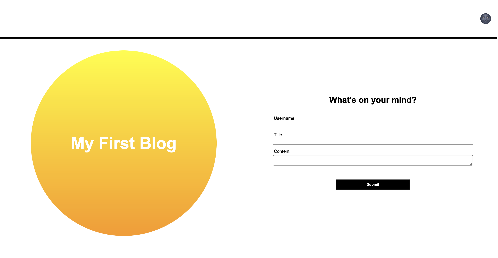
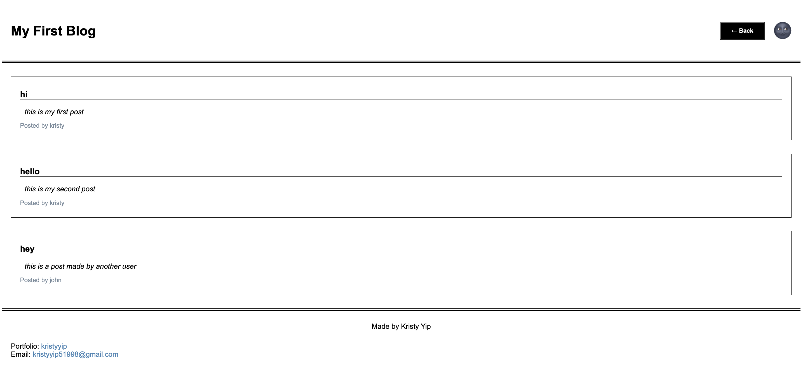
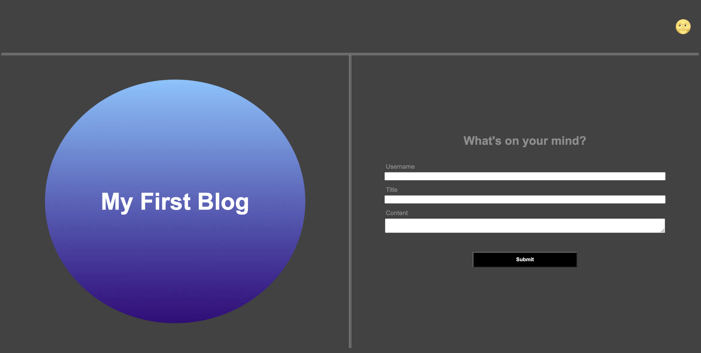
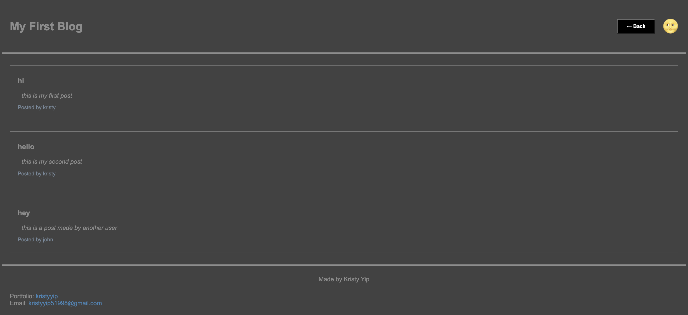

# Module 04 Challenge: Web APIs / Personal Blog

## Description
This is the challenge for Module 04 of the coding bootcamp. This is a two-page website where users submit a blog post through a form, which will then be displayed on a different page.

### User Story
```
AS A marketing student
I WANT a personal blog
SO THAT I can showcase my thoughts and experiences
```

### Acceptance Criteria
```
GIVEN a personal blog
WHEN I load the app,
THEN I am presented with the landing page containing a form with labels and inputs for username, blog title, and blog content.
WHEN I submit the form,
THEN blog post data is stored to localStorage.
WHEN the form submits,
THEN I am redirected to the posts page.
WHEN I enter try to submit a form without a username, title, or content,
THEN I am presented with a message that prompts me to complete the form.
WHEN I view the posts page,
THEN I am presented with a header, with a light mode/dark mode toggle, and a "Back" button.
WHEN I click the light mode/dark mode toggle,
THEN the page content's styles update to reflect the selection.
WHEN I click the "Back" button,
THEN I am redirected back to the landing page where I can input more blog entries.
WHEN I view the main content,
THEN I am presented with a list of blog posts that are pulled from localStorage.
WHEN I view localStorage,
THEN I am presented with a JSON array of blog post objects, each including the post author's username, title of the post, and post's content.
WHEN I take a closer look at a single blog entry in the list,
THEN I can see the title, the content, and the author of the post.
WHEN I view the footer,
THEN I am presented with a link to the developer's portfolio.
```

## Deployed Application
The project has been deployed [here](https://https://kristyyip.github.io/module-04-blog/).

The first page contains a form to submit a blog post.


The form will then redirect the user to the blog posts page.


There is also an option to change the theme to dark mode.



## Citations
MDN contributors (2023). "Window: load event." JavaScript. https://developer.mozilla.org/en-US/docs/Web/API/Window/load_event.

ruakh (2012). "Insert Unicode character into JavaScript." JavaScript. https://stackoverflow.com/questions/13093126/insert-unicode-character-into-javascript.

Sakhniuk, Michael (2022). "Why does it return false when comparing two similar objects in JavaScript?" JavaScript. https://iq.js.org/questions/javascript/why-does-it-return-false-when-comparing-two-similar-objects-in-javascript.

UltraInstict (2013). "HTML5 LocalStorage: Checking if a key exists [duplicate]." JavaScript. https://stackoverflow.com/questions/16010827/html5-localstorage-checking-if-a-key-exists.

